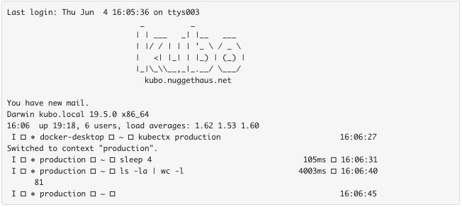
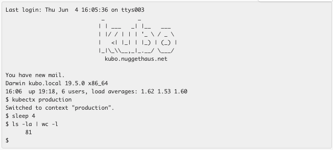

# fishpaste

This is a little tool I use to make it easier to paste terminal session
snippets into other apps like Slack or IRC.  It's tailored to take a clipboard
buffer from one of my terminal sessions and cleaning up all the fancy Fish
shell prompt data so that the resultant paste is easier to read.

I hook it up to an [Alfred] workflow so that I just have to hit Shift-Command-V
and the pastebuffer will be filtered through the app automatically.

Currently the filtering is 100% specific to my shell configuration and isn't
likely to work for anyone else.  In theory this could be extended into a more
general-purpose filter that would be more universally useful.

For now, though, it scratches my itch.

## Without Fish Paste

My Fish setup has a fancy left prompt that uses a lot of goofy unicode
characters paired with a right prompt that includes timestamps and command
runtime information.  It's great for interactive use, but it is a real pain
whenever I want to cut and paste a piece of my work onto Slack or a Reddit post
or something like that.

Taking terminal output like this:

Without any processing, pasting the text into Slack isn't the greatest experience:

Using the Fish Paste filter, though, it's much nicer:

[Alfred]: https://alfredapp.com/
