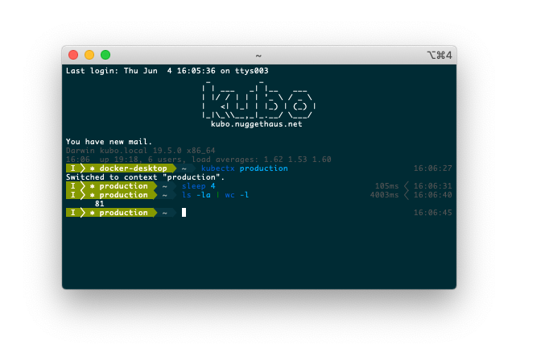

[](https://github.com/nugget/fishpaste/actions?query=workflow%3AGo) [](https://goreportcard.com/report/github.com/nugget/fishpaste)

# Fish Paste filter

This is a little tool I use to make it easier to paste terminal session
snippets into other apps like Slack or IRC.  It's tailored to take a clipboard
buffer from one of my terminal sessions and cleaning up all the fancy Fish
shell prompt data so that the resultant paste is easier to read.

I hook it up to an [Alfred] workflow so that I just have to hit Shift-Command-V
and the pastebuffer will be filtered through the app automatically.

Currently the filtering is 100% specific to my shell configuration and isn't
likely to work for anyone else.  In theory this could be extended into a more
general-purpose filter that would be more universally useful.

For now, though, it scratches my itch.

## How I use this tool 

My Fish setup has a fancy left prompt that uses a lot of goofy unicode
characters paired with a right prompt that includes timestamps and command
runtime information.  It's great for interactive use, but it is a real pain
whenever I want to cut and paste a piece of my work onto Slack or a Reddit post
or something like that.

Taking terminal output like this:



Without any processing, pasting the text into Slack isn't the greatest experience:

```console
Last login: Thu Jun  4 16:05:36 on ttys003
                             _          _
                            | | ___   _| |__   ___
                            | |/ / | | | '_ \ / _ \
                            |   <| |_| | |_) | (_) |
                            |_|\_\\__,_|_.__/ \___/
                              kubo.nuggethaus.net

You have new mail.
Darwin kubo.local 19.5.0 x86_64
16:06  up 19:18, 6 users, load averages: 1.62 1.53 1.60
 I  ⎈ docker-desktop  ~  kubectx production                          16:06:27
Switched to context "production".
 I  ⎈ production  ~  sleep 4                                 105ms  16:06:31
 I  ⎈ production  ~  ls -la | wc -l                         4003ms  16:06:40
      81
 I  ⎈ production  ~ 
```

Using the Fish Paste filter, though, it's much nicer:

```console
Last login: Thu Jun  4 16:05:36 on ttys003
                             _          _
                            | | ___   _| |__   ___
                            | |/ / | | | '_ \ / _ \
                            |   <| |_| | |_) | (_) |
                            |_|\_\\__,_|_.__/ \___/
                              kubo.nuggethaus.net

You have new mail.
Darwin kubo.local 19.5.0 x86_64
16:06  up 19:18, 6 users, load averages: 1.62 1.53 1.60
$ kubectx production
Switched to context "production".
$ sleep 4
$ ls -la | wc -l
      81
$
```

## Manual Operation

In macOS this can be used directly without Alfred.  It simply expects the
clipboard data to arrive on stdin and then emits the sanitized text to stdout.
You can run it like this as well:

`pbpaste | fishpaste | pbcopy`

[Alfred]: https://alfredapp.com/
